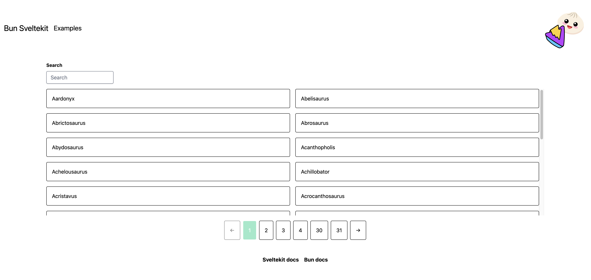

# Dinosaur example with SvelteKit

The goal of this application is to showcase different parts of how SvelteKit works.

## Setup

1. Install dependencies using `bun install`
2. You must copy the `.env.example` file to a `.env` file.
3. Run the `bun run db:push` to set up a SQLite DB.
4. Run the application `bun run dev --open`.
5. Navigate to the "Examples" page and click the "Send" button under "Seed the database"

### What the app should look like

### Highlights

On the homepage there is a paginated result of dinosaurs that is searchable using query parameters and every time you press "enter" we are updating the results to the page.

On the examples site there are several inputs to showcase.

- Form inputs that are using `use:enhance` and one that is not.
- A reactive slider to showcase `$state` and `$derived`.
- Deeply reactive state thanks to symbols (see todo list).
- State proxies to show a unique issue passing state directly.
